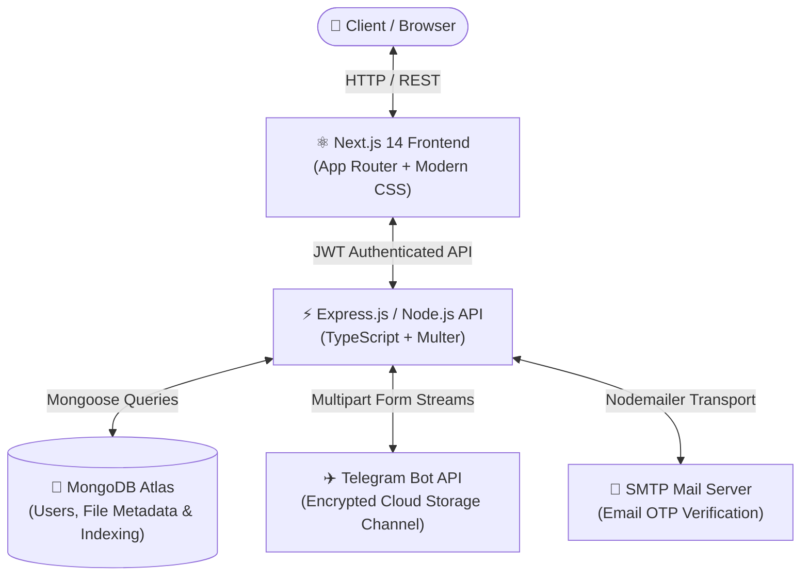

<div align="center">

# ⚡ TeleVault
### *Unlimited, Encrypted Cloud Storage Powered by Telegram Bot API & MongoDB Atlas*

[](https://televalut-app.onrender.com/login/)
[](https://nextjs.org/)
[](https://www.typescriptlang.org/)
[](https://nodejs.org/)
[](https://www.mongodb.com/atlas)
[](https://core.telegram.org/bots/api)
[](LICENSE)

<p align="center">
  <b>TeleVault</b> transforms the Telegram Bot API into a secure, infinite, and zero-cost cloud storage drive with a high-performance, modern web UI.
</p>

<p align="center">
  🚀 <b>Live Production App:</b> <a href="https://televalut-app.onrender.com/login/"><b>https://televalut-app.onrender.com/login/</b></a>
</p>

[🌐 Live Demo](https://televalut-app.onrender.com/login/) • [🎬 Demo Video](#-live-demo-video) • [✨ Features](#-key-features) • [🏛️ Architecture](#-system-architecture) • [🚀 Quick Start](#-getting-started) • [⚙️ Configuration](#-environment-variables)

---

</div>

## 🎬 Live Demo Video

https://github.com/vishnu6383/TeleValut/raw/main/assets/televalut-demo.mp4

---

## 🌟 Overview

Traditional cloud storage platforms impose strict storage limits, bandwidth throttle, and expensive monthly subscriptions. **TeleVault** leverages Telegram's cloud infrastructure as a decentralized binary storage layer while maintaining metadata, indexing, and user authentication on **MongoDB Atlas**.

With instant media streaming, multi-file batch downloading, email OTP authentication, and a dedicated photo gallery with high-res Lightbox previews, TeleVault delivers a cloud experience that rivals modern consumer platforms.

---

## ✨ Key Features

### 🖼️ High-Res Photo Gallery & Fullscreen Lightbox
- **Visual Grid**: Image-first responsive layout with zoom-on-hover thumbnails and format badges.
- **Interactive Lightbox**: Inspect photos in full resolution without leaving the dashboard, complete with metadata and direct download actions.

### ⬇️ Selective Multi-File Batch Downloading
- **Multi-Select Mode**: Select individual files or use **Select All** across gallery and document views.
- **Floating Batch Toolbar**: One-click download or delete for multiple items simultaneously.
- **Popup-Safe Sequential Streaming**: Bypasses browser popup blockers through staggered async streams.

### 🌓 Dynamic Light & Dark Mode
- Built-in theme switcher with persistent user preference (`localStorage`).
- Carefully tuned CSS variables for low-light dark aesthetics and crisp light modes.

### 🛡️ Enterprise-Grade Email OTP Verification
- **Real-Time Delivery**: SMTP transport delivering 6-digit cryptographic verification codes.
- **Brute-Force Shield**: SHA-256 hashed OTPs, 10-minute validity expiry, 60-second resend cooldown, and 5-attempt brute-force lockouts.

### 🍃 MongoDB Atlas Cloud Integration
- Fast, scalable cloud database storing user profiles, storage telemetry, and Telegram file pointer indices.
- Fully typed Mongoose models with automated compound indexing for sub-millisecond query response times.

### 🔔 Live Toast Alerts & Drag-and-Drop
- Instant feedback animations on upload (`File uploaded successfully!`), batch deletions, and downloads.
- Seamless drag-and-drop dropzones with progress indicators.

---

## 🏛️ System Architecture



---

## 🛠️ Technology Stack

| Layer | Technologies |
|---|---|
| **Frontend** | [Next.js 14](https://nextjs.org/) (App Router), React 18, TypeScript, Vanilla CSS3 Design System |
| **Backend** | [Node.js](https://nodejs.org/), [Express.js](https://expressjs.com/), TypeScript, Multer, Axios |
| **Database** | [MongoDB Atlas](https://www.mongodb.com/atlas) via [Mongoose ODM](https://mongoosejs.com/) |
| **Storage Engine** | [Telegram Bot API](https://core.telegram.org/bots/api) (`sendDocument`, `getFile`) |
| **Auth & Security** | JSON Web Tokens (JWT), Bcrypt password hashing, SHA-256 OTP hashing |
| **Email Service** | [Nodemailer](https://nodemailer.com/) (Gmail SMTP / Custom SMTP) |

---

## 🚀 Getting Started

### 1. Prerequisites
Ensure you have the following installed on your machine:
- **Node.js**: `v18.0.0` or higher
- **npm** or **yarn**
- **Git**
- A **Telegram Bot Token** and private channel ID (from [@BotFather](https://t.me/BotFather))
- A **MongoDB Atlas** database connection URI
- An **SMTP App Password** (e.g., Google App Password for OTP emails)

---

### 2. Clone Repository

```bash
git clone https://github.com/vishnu6383/TeleValut.git
cd TeleValut
```

---

### 3. Setup Backend

1. Navigate to the backend directory and install dependencies:
   ```bash
   cd backend
   npm install
   ```

2. Create and configure `backend/.env`:
   ```env
   NODE_ENV=development
   PORT=5000
   FRONTEND_URL=http://localhost:3000

   # MongoDB Atlas Connection
   DATABASE_URL=mongodb+srv://<username>:<password>@telecluster.wbmwcsr.mongodb.net/televault?retryWrites=true&w=majority

   # JWT Auth
   JWT_SECRET=your_super_secret_jwt_key_here
   JWT_EXPIRES_IN=7d

   # Telegram Bot Configuration
   TELEGRAM_BOT_TOKEN=your_telegram_bot_token
   TELEGRAM_CHANNEL_ID=your_telegram_private_channel_id

   # SMTP Email Verification
   EMAIL_HOST=smtp.gmail.com
   EMAIL_PORT=587
   EMAIL_USER=your_email@gmail.com
   EMAIL_PASSWORD=your_gmail_app_password
   EMAIL_FROM=TeleVault <your_email@gmail.com>

   # Max File Limit (50MB by default for Telegram Bot API)
   MAX_FILE_SIZE_BYTES=52428800
   ```

3. Build and test backend:
   ```bash
   npm run build
   ```

---

### 4. Setup Frontend

1. Navigate to the frontend directory and install dependencies:
   ```bash
   cd ../frontend
   npm install
   ```

2. Create and configure `frontend/.env.local` (optional, defaults to port 5000):
   ```env
   NEXT_PUBLIC_API_URL=http://localhost:5000/api
   ```

3. Verify production build:
   ```bash
   npm run build
   ```

---

### 5. Running the Project

You can run both Frontend and Backend concurrently from the root directory:

```bash
# From the project root
npm run dev
```

* **Frontend Client**: [http://localhost:3000](http://localhost:3000)
* **Backend API**: [http://localhost:5000/api](http://localhost:5000/api)

---

## 📁 Project Structure

```text
photo_project/
├── backend/
│   ├── src/
│   │   ├── config/
│   │   │   └── database.ts          # MongoDB Atlas Mongoose connection
│   │   ├── middleware/
│   │   │   └── auth.ts              # JWT Bearer authentication middleware
│   │   ├── models/
│   │   │   ├── File.ts              # Mongoose File metadata schema & indexes
│   │   │   └── User.ts              # Mongoose User & OTP schema & indexes
│   │   ├── routes/
│   │   │   ├── auth.ts              # Register, Login, Email OTP, Logout
│   │   │   └── files.ts             # Upload, Download, Stats, Batch Actions
│   │   ├── services/
│   │   │   ├── emailService.ts      # SMTP Transporter & HTML OTP Templates
│   │   │   └── telegramService.ts   # Telegram Bot API file streaming
│   │   └── server.ts                # Express application entry point
│   ├── package.json
│   └── tsconfig.json
│
├── frontend/
│   ├── app/
│   │   ├── dashboard/
│   │   │   └── page.tsx             # Main Vault Dashboard, Gallery & Multi-select
│   │   ├── login/
│   │   │   └── page.tsx             # Login Screen
│   │   ├── register/
│   │   │   └── page.tsx             # Account Registration
│   │   ├── verify-email/
│   │   │   └── page.tsx             # 6-Digit OTP verification with auto-advance
│   │   ├── globals.css              # Custom themes (Light/Dark) & Component Styles
│   │   ├── layout.tsx               # Root application layout
│   │   └── not-found.tsx            # Custom 404 handler
│   ├── lib/
│   │   └── api.ts                   # Fetch API wrapper with credentials
│   ├── package.json
│   └── tsconfig.json
│
├── .env.example                     # Environment template
├── .gitignore                       # Git ignore configuration
├── package.json                     # Root orchestrator scripts
└── README.md                        # Documentation
```

---

## 🔒 Security Highlights

* **No Plaintext Passwords**: Passwords hashed using standard `bcrypt` rounds.
* **Transient Memory Uploads**: File uploads are buffered in memory and streamed directly to Telegram without residing on the local disk.
* **OTP Rate-Limiting**: Protection against brute-force attacks with automated attempt lockouts and SHA-256 hashed verification tokens.
* **Strict CORS & Sanitized Headers**: Configured to restrict origin requests and sanitize headers.

---

## 📄 License

This project is licensed under the **MIT License** - see the [LICENSE](LICENSE) file for details.

---

<div align="center">
  <sub>Built with ❤️ by <a href="https://github.com/vishnu6383">Vishnu</a></sub>
</div>
